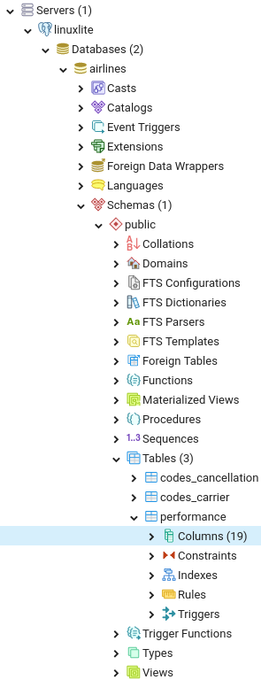
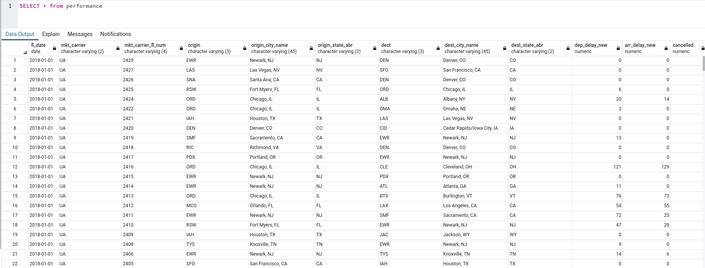
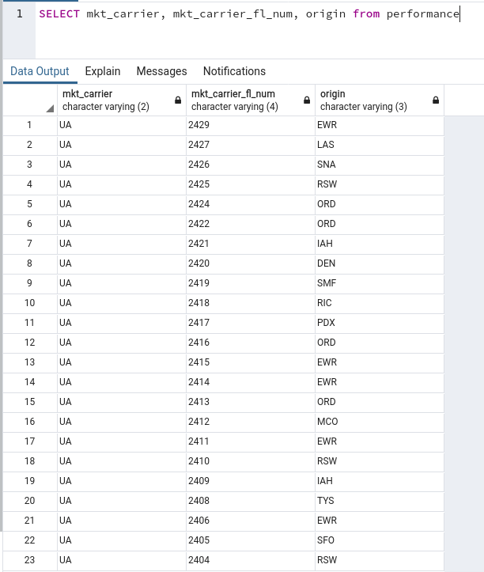
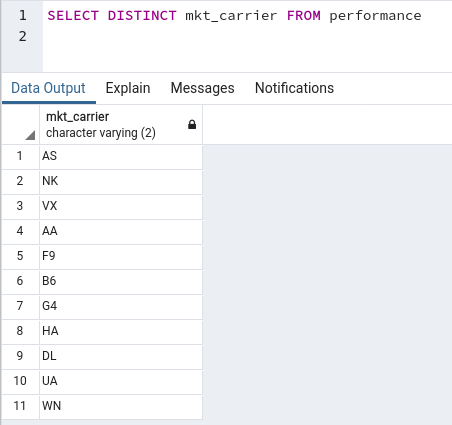
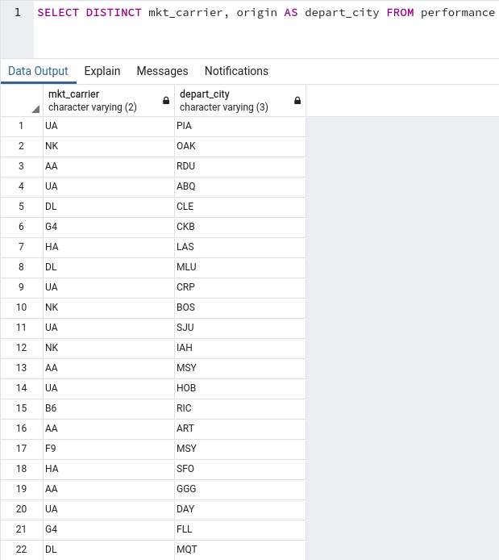
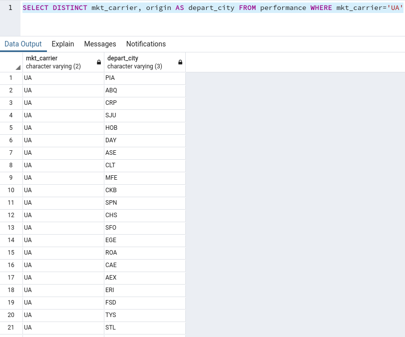
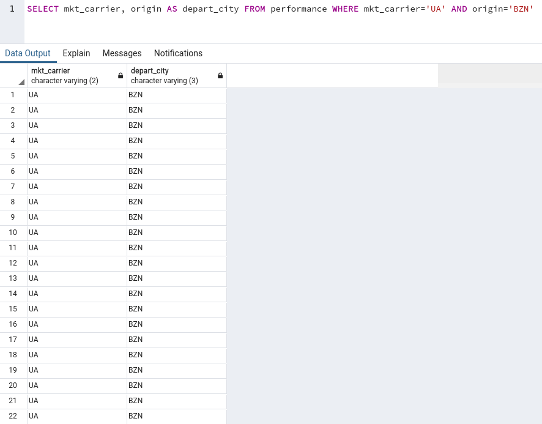
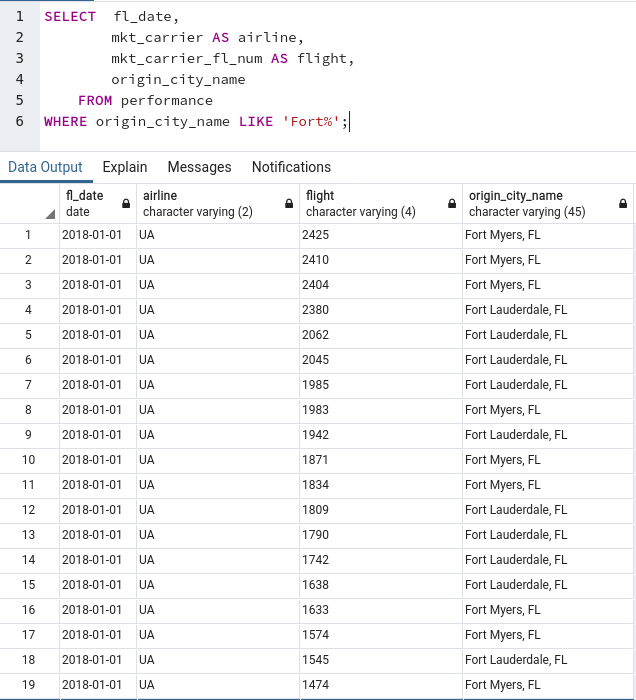
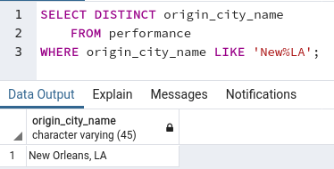

# POSTGRESQL

## Installation prealable

1. https://www.postgresql.org/download/linux/ubuntu/

2. https://wiki.postgresql.org/wiki/Apt

```cmd
Succès. Vous pouvez maintenant lancer le serveur de bases de données en utilisant :

    pg_ctlcluster 11 main start

```

3. Verifier version postgresql

```cmd
psql --version
```

4. Demarrage postgres

```cmd
sudo -i -u postgres
pg_ctlcluster 11 main start
sudo -i -u postgres
psql
```

5. Redemarrage service postgreql

```cmd
sudo service postgresql restart
```

6. Suivre les recommandation §3.7 https://doc.ubuntu-fr.org/postgresql


## Creation de la base de donnée


1. Suivre les instructions suivant: 





## Visualiser le contenu de vos tables dans pg4Admin

#### SELECT

Exemple: Interroger tous le contenu de la table performance:

```sql
SELECT * FROM performance
```




Exemple: Interroger le contenu des colonnes mkt_carrier, mkt_carrier_fl_num, origine  de la table performance:

```sql
SELECT mkt_carrier, mkt_carrier_fl_num, origin FROM performance
```



Exemple: Interroger le contenu des colonnes mkt_carrier, mkt_carrier_fl_num, origin renomme de la table performance: 

```sql
SELECT mkt_carrier AS airline, mkt_carrier_fl_num AS flight, origin AS depart_city FROM performance
```


#### SELECT DISTINCT

Exemple: Interroger le contenu de la colonne mkt_carrier de la table performance en retirant les doublons

```sql
SELECT DISTINCT mkt_carrier FROM performance
```




Exemple: Interroger le contenu de la colonne mkt_carrier  et de la colonne origin renomme de la table performance en retirant les doublons

```sql
SELECT DISTINCT mkt_carrier, origin AS depart_city FROM performance
```



## Limiter le nombre de resultat

#### Clause WHERE

Exemple: Interroger le contenu de la colonne mkt_carrier  et de la colonne origin renomme de la table performance en retirant les doublons lorsque mkt_carrier='UA'

```sql
SELECT DISTINCT mkt_carrier, origin AS depart_city FROM performance WHERE mkt_carrier='UA'
```




#### Clause WHERE avec operateur de comparaison (et, ou, >, <, =, <>,>= et <=)

Exemple: Interroger le contenu de la colonne mkt_carrier  et de la colonne origin renomme de la table performance lorsque mkt_carrier='UA' et depart_city='BZN'

```sql
SELECT mkt_carrier, origin AS depart_city FROM performance WHERE mkt_carrier='UA' AND origin='BZN'
```



#### Matching patterns (LIKE)

Le pattern peut prendre un caratere generique avec %.

Oubien nous cherchons le terme exact avec _.

Exemple: Interroge notre table performance lorsque origin_city_name match avec 'Fort%' (plus qqchose).

```sql
SELECT 	fl_date,
		mkt_carrier AS airline,
		mkt_carrier_fl_num AS flight,
		origin_city_name 
	FROM performance
WHERE origin_city_name LIKE 'Fort%';
```



Exemple: Interroge notre table performance lorsque origin_city_name match avec 'New%LA' en retirant les doublons.

```sql
SELECT DISTINCT	origin_city_name 
	FROM performance
WHERE origin_city_name LIKE 'New%LA';
```




## TIPS Postgresql

1. Liste des user

```cmd
postgres=# \du
```

2. Creation d'un user

```sql
postgres=# CREATE USER [nom user];
```

3. Donner les droits a l'user

```sql
postgres=# ALTER ROLE [nom user] WITH CREATEDB;
```

4. Creation d'une base de donnee

```sql
postgres=# CREATE DATABASE [nom base de donnee] OWNER [nom user];
```


5. Attribuer un mot de passe

```sql
postgres=# ALTER USER [nom user] WITH ENCRYPTED PASSWORD 'mon_mot_de_passe';
```

6. Test

```cmd
postgres=# \q
postgres@linuxlite:~$ psql nom_base_de_donnee
```

7. Infos connexion

```cmd
postgres=# \q
postgres@linuxlite:~$ psql nom_base_de_donnee
```

8. Fichier de configuration

```cmd
root/etc/postgresql/11/main/pg_hba.conf
```

9. Connaitre et changer le Datestyle de la base de donnée

```sql
show datestyle ;
....
ALTER DATABASE [nom de base de donnee] SET Datestyle=iso, mdy;
```