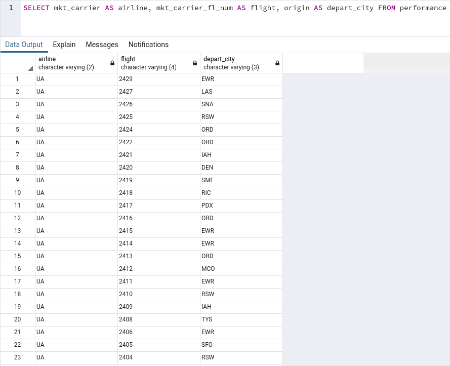
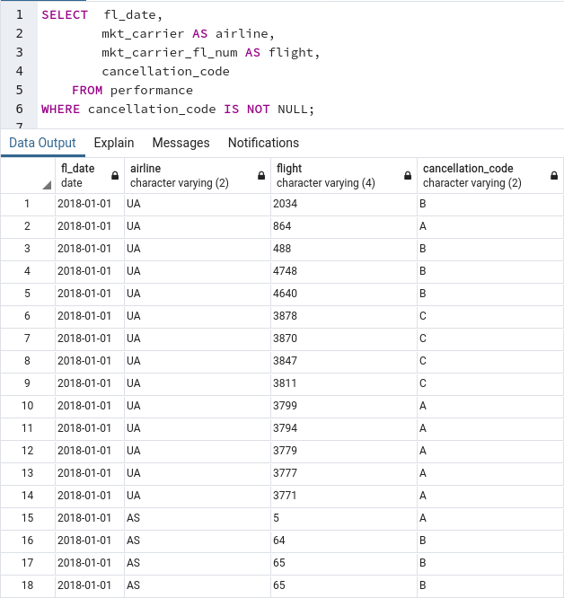

<a id="markdown-postgresql" name="postgresql"></a>
# POSTGRESQL

Sommaire:

<!-- TOC -->autoauto- [POSTGRESQL](#postgresql)auto    - [Installation prealable](#installation-prealable)auto    - [Creation de la base de donnée](#creation-de-la-base-de-donnée)auto    - [Visualiser le contenu de vos tables dans pg4Admin](#visualiser-le-contenu-de-vos-tables-dans-pg4admin)auto            - [SELECT](#select)auto            - [SELECT DISTINCT](#select-distinct)auto    - [Limiter le nombre de resultat](#limiter-le-nombre-de-resultat)auto            - [Clause WHERE](#clause-where)auto            - [Clause WHERE avec operateur de comparaison (et, ou, >, <, =, <>,>= et <=)](#clause-where-avec-operateur-de-comparaison-et-ou-----et-)auto            - [Matching patterns (LIKE)](#matching-patterns-like)auto            - [IS NULL et IS NOT NULL](#is-null-et-is-not-null)auto            - [Combinaisons (BETWEEN et IN)](#combinaisons-between-et-in)auto            - [Ordre dde priorite des operations](#ordre-dde-priorite-des-operations)auto    - [Utilisation de JOIN](#utilisation-de-join)auto            - [Data Key](#data-key)auto            - [INNER JOIN](#inner-join)auto            - [Utilisation d'alias](#utilisation-dalias)auto            - [OUTER JOIN](#outer-join)auto            - [FULL JOIN](#full-join)auto            - [Rechercher dans les tables (LOOKUP)](#rechercher-dans-les-tables-lookup)auto    - [Presenter et agreger vos résultats](#presenter-et-agreger-vos-résultats)auto            - [Trier les resultats](#trier-les-resultats)auto            - [Application de calculs agreges](#application-de-calculs-agreges)auto            - [Filtration de resultat agreges](#filtration-de-resultat-agreges)auto    - [TIPS Postgresql](#tips-postgresql)autoauto<!-- /TOC -->

<a id="markdown-installation-prealable" name="installation-prealable"></a>
## Installation prealable

1. https://www.postgresql.org/download/linux/ubuntu/

2. https://wiki.postgresql.org/wiki/Apt

```cmd
Succès. Vous pouvez maintenant lancer le serveur de bases de données en utilisant :

    pg_ctlcluster 11 main start

```

3. Verifier version postgresql

```cmd
psql --version
```

4. Demarrage postgres

```cmd
sudo -i -u postgres
pg_ctlcluster 11 main start
sudo -i -u postgres
psql
```

5. Redemarrage service postgreql

```cmd
sudo service postgresql restart
```

6. Suivre les recommandation §3.7 https://doc.ubuntu-fr.org/postgresql


<a id="markdown-creation-de-la-base-de-donnée" name="creation-de-la-base-de-donnée"></a>
## Creation de la base de donnée


1. Suivre les instructions suivant: 


<a id="markdown-visualiser-le-contenu-de-vos-tables-dans-pg4admin" name="visualiser-le-contenu-de-vos-tables-dans-pg4admin"></a>
## Visualiser le contenu de vos tables dans pg4Admin

<a id="markdown-select" name="select"></a>
#### SELECT

Exemple: Interroger tous le contenu de la table performance:

```sql
SELECT * FROM performance
```


Exemple: Interroger le contenu des colonnes mkt_carrier, mkt_carrier_fl_num, origine  de la table performance:

```sql
SELECT mkt_carrier, mkt_carrier_fl_num, origin FROM performance
```


Exemple: Interroger le contenu des colonnes mkt_carrier, mkt_carrier_fl_num, origin renomme de la table performance: 

```sql
SELECT mkt_carrier AS airline, mkt_carrier_fl_num AS flight, origin AS depart_city FROM performance
```



<a id="markdown-select-distinct" name="select-distinct"></a>
#### SELECT DISTINCT

Exemple: Interroger le contenu de la colonne mkt_carrier de la table performance en retirant les doublons

```sql
SELECT DISTINCT mkt_carrier FROM performance
```


Exemple: Interroger le contenu de la colonne mkt_carrier  et de la colonne origin renomme de la table performance en retirant les doublons

```sql
SELECT DISTINCT mkt_carrier, origin AS depart_city FROM performance
```


<a id="markdown-limiter-le-nombre-de-resultat" name="limiter-le-nombre-de-resultat"></a>
## Limiter le nombre de resultat

<a id="markdown-clause-where" name="clause-where"></a>
#### Clause WHERE

Exemple: Interroger le contenu de la colonne mkt_carrier  et de la colonne origin renomme de la table performance en retirant les doublons lorsque mkt_carrier='UA'

```sql
SELECT DISTINCT mkt_carrier, origin AS depart_city FROM performance WHERE mkt_carrier='UA'
```


<a id="markdown-clause-where-avec-operateur-de-comparaison-et-ou-----et-" name="clause-where-avec-operateur-de-comparaison-et-ou-----et-"></a>
#### Clause WHERE avec operateur de comparaison (et, ou, >, <, =, <>,>= et <=)

Exemple: Interroger le contenu de la colonne mkt_carrier  et de la colonne origin renomme de la table performance lorsque mkt_carrier='UA' et depart_city='BZN'

```sql
SELECT mkt_carrier, origin AS depart_city FROM performance WHERE mkt_carrier='UA' AND origin='BZN'
```


<a id="markdown-matching-patterns-like" name="matching-patterns-like"></a>
#### Matching patterns (LIKE)

Le pattern peut prendre un caratere generique avec %.

Oubien nous cherchons le terme exact avec _.

Exemple: Interroge notre table performance lorsque origin_city_name match avec 'Fort%' (plus qqchose).

```sql
SELECT 	fl_date,
		mkt_carrier AS airline,
		mkt_carrier_fl_num AS flight,
		origin_city_name 
	FROM performance
WHERE origin_city_name LIKE 'Fort%';
```


Exemple: Interroge notre table performance lorsque origin_city_name match avec 'New%LA' en retirant les doublons.

```sql
SELECT DISTINCT	origin_city_name 
	FROM performance
WHERE origin_city_name LIKE 'New%LA';
```


Exemple: Interroge notre table performance lorsque origin_city_name match avec '____,KS'.

```sql
SELECT DISTINCT	origin_city_name 
	FROM performance
WHERE origin_city_name LIKE '____, KS';
```


Exemple: Interroge notre table performance lorsque origin_city_name match avec '____,%'.

```sql
SELECT DISTINCT	origin_city_name 
	FROM performance
WHERE origin_city_name LIKE '____, %';
```


*A l'inverser nous pouvons utiliser la clause WHERE...NOT LIKE*


<a id="markdown-is-null-et-is-not-null" name="is-null-et-is-not-null"></a>
#### IS NULL et IS NOT NULL

Le contenu d'un champs retourne NULL lorsque:

* celui-ci est abscent, sql reconnaît un champ vide comme une valeur nulle
* lors d'un calcule faux (par exemple x/0)
* l'utilisation d'un caractère d'espace vide est une mauvaise pratique

Exemple: Interroge notre table performance lorsque cancellation_code IS NOT NULL.

```sql
SELECT	fl_date,
		mkt_carrier AS airline,
		mkt_carrier_fl_num AS flight,
		cancellation_code
	FROM performance
WHERE cancellation_code IS NOT NULL;

```



Exemple: Interroge notre table performance lorsque cancellation_code IS NULL.

```sql
SELECT	fl_date,
		mkt_carrier AS airline,
		mkt_carrier_fl_num AS flight,
		cancellation_code
	FROM performance
WHERE cancellation_code IS NULL;

```


<a id="markdown-combinaisons-between-et-in" name="combinaisons-between-et-in"></a>
#### Combinaisons (BETWEEN et IN)

Exemple: Interroge une table pour retourner les resultats compris entre deux valeur (encadrement).

```sql
SELECT	first_name,
		age
	FROM person
WHERE age >=19
	AND age <=35;
```

Et equivalent à :

```sql
SELECT	first_name,
		age
	FROM person
WHERE age BETWEEN 19 and 35;
```

Exemple: Interroge une table pour retourner les resultats avec une clause de multiple OR.

```sql
SELECT	first_name,
		age
	FROM person
WHERE first_name = "Jimmy"
	OR first_name = "Brenna"
	OR first_name = "Elmo";
```

Et equivalent à :

```sql
SELECT	first_name,
		age
	FROM person
WHERE first_name IN 
	("Jimmy, Brenna, Elmo")
```

Inversement:

```sql
SELECT	first_name,
		age
	FROM person
WHERE first_name NOT IN 
	("Jimmy, Brenna, Elmo")
```

<a id="markdown-ordre-dde-priorite-des-operations" name="ordre-dde-priorite-des-operations"></a>
#### Ordre dde priorite des operations

* AND a une priorité d'opérateur plus élevée que OR

Exemple:


* Le contenu compris entre () est evalue avant le reste.

Exemple:


<a id="markdown-utilisation-de-join" name="utilisation-de-join"></a>
## Utilisation de JOIN

* L'utilisation de JOIN permet de recuperer une combinaison d'enregistrement et de datas issues de plusieurs tables.

* JOIN permet d'avoir une database relationnelle.
* 3 types de JOIN exist (INNER, OUTER et FULL JOIN)

<a id="markdown-data-key" name="data-key"></a>
#### Data Key

* Les cles sont des champs qui décrivent les relations entre les tables
* Une cle primaire (Primary key) sont unique pour chaque enrtegistrement dans la table
* Une cle etrangere d'une table fait reference à la cle primaire d'une autre table 

<a id="markdown-inner-join" name="inner-join"></a>
#### INNER JOIN


* Renvoie toutes les lignes de deux tables ou plus qui remplissent la condition de jointure
* Les champs joints doivent exister dans les deux tables

Exemple:


Resultat:


Exemple avec limitation des resultats:


Exemple avec limitation des resultats avec clause where:


Syntaxe alternative:


<a id="markdown-utilisation-dalias" name="utilisation-dalias"></a>
#### Utilisation d'alias

Exemple:


Par convention les alias sont notés telque:


L'alias deviens implicite et le mot cle AS disparait.

<a id="markdown-outer-join" name="outer-join"></a>
#### OUTER JOIN


Syntaxes:

LEFT OUTER JOIN ---> equivalent a ---> LEFT JOIN

RIGHT OUTER JOIN ---> equivalent a ---> RIGHT JOIN

Exemple LEFT OUTER JOIN:

```sql
SELECT	c.first_name,
		c.last_name,
		o.order_date,
		o.order_amount
	FROM customers c
LEFT OUTER JOIN orders o
		ON c.customers_id = o.customers_id
```

Resultat:


Exemple RIGHT OUTER JOIN:
```sql
SELECT	c.first_name,
		c.last_name,
		o.order_date,
		o.order_amount
	FROM customers c
RIGHT OUTER JOIN orders o
		ON c.customers_id = o.customers_id
```

Resultat:


LEFT OUTER JOIN sont beaucoup plus répandues dans la pratique.

Peut être plus facile à lire et à interpréter.


<a id="markdown-full-join" name="full-join"></a>
#### FULL JOIN


* Renvoie toutes les lignes de deux tables ou plus, que la condition de jointure soit remplie ou non.
* Si aucune correspondance, le côté manquant contiendra null

Exemple FULL OUTER JOIN:

```sql
SELECT	c.first_name,
		c.last_name,
		o.order_date,
		o.order_amount
	FROM customers c
FULL OUTER JOIN orders o
		ON c.customers_id = o.customers_id
```

Resultat:

Le mot clé FULL OUTER JOIN spécifie le type de jointure ON les champs à joindre y compris les enregistrements sans correspondance (null).


<a id="markdown-rechercher-dans-les-tables-lookup" name="rechercher-dans-les-tables-lookup"></a>
#### Rechercher dans les tables (LOOKUP)

Exemple: Dans cet exemple, nous allons utiliser une table de correspondance (LOOKUP TABLE) pour convertir nos codes d'operateur de marketing en noms de compagnie aeriennes.

```sql
SELECT 	p.fl_date,
		p.mkt_carrier,
		cc.carrier_desc AS airline,
		p.mkt_carrier_fl_num AS flight,
		p.origin_city_name,
		p.dest_city_name,
		p.cancellation_code,
		ca.cancel_desc
	FROM performance p
		INNER JOIN codes_carrier cc 
			ON p.mkt_carrier = cc.carrier_code
		LEFT JOIN codes_cancellation ca
			ON p.cancellation_code = ca.cancellation_code;
```

Utiliser une clause WHERE p.cancellation_code IS NOT NULL, pour limiter les resultats.


Recap diagram de Venn:


https://en.wikipedia.org/wiki/Venn_diagram


<a id="markdown-presenter-et-agreger-vos-résultats" name="presenter-et-agreger-vos-résultats"></a>
## Presenter et agreger vos résultats

<a id="markdown-trier-les-resultats" name="trier-les-resultats"></a>
#### Trier les resultats


Exemple *ORDER BY*:

```sql
SELECT 	name,
		state
	FROM residency
	ORDER BY state, name;
```

Resultat:


Exemple *ORDER BY [field] DESC, [other_field] ASC*:

```sql
SELECT 	name,
		state
	FROM residency
	ORDER BY state DESC, name ASC;
```

Resultat:


Exemple sort *ORDER BY [num_colomn] DESC, [other_num_colomn] ASC*

```sql
SELECT 	name,
		state
	FROM residency
	ORDER BY 2 DESC, 1 ASC;
```

Resultat identique que precedemment.


<a id="markdown-application-de-calculs-agreges" name="application-de-calculs-agreges"></a>
#### Application de calculs agreges

* COUNT
* SUM
* AVG
* MIN
* MAX


<a id="markdown-filtration-de-resultat-agreges" name="filtration-de-resultat-agreges"></a>
#### Filtration de resultat agreges

* WHERE ==> Filtre simple ligne
* HAVING ==> Filtre de resultats agreges


<a id="markdown-tips-postgresql" name="tips-postgresql"></a>
## TIPS Postgresql

1. Liste des user

```cmd
postgres=# \du
```

2. Creation d'un user

```sql
postgres=# CREATE USER [nom user];
```

3. Donner les droits a l'user

```sql
postgres=# ALTER ROLE [nom user] WITH CREATEDB;
```

4. Creation d'une base de donnee

```sql
postgres=# CREATE DATABASE [nom base de donnee] OWNER [nom user];
```


5. Attribuer un mot de passe

```sql
postgres=# ALTER USER [nom user] WITH ENCRYPTED PASSWORD 'mon_mot_de_passe';
```

6. Test

```cmd
postgres=# \q
postgres@linuxlite:~$ psql nom_base_de_donnee
```

7. Infos connexion

```cmd
postgres=# \q
postgres@linuxlite:~$ psql nom_base_de_donnee
```

8. Fichier de configuration

```cmd
root/etc/postgresql/11/main/pg_hba.conf
```

9. Connaitre et changer le Datestyle de la base de donnée

```sql
show datestyle ;
....
ALTER DATABASE [nom de base de donnee] SET Datestyle=iso, mdy;
```